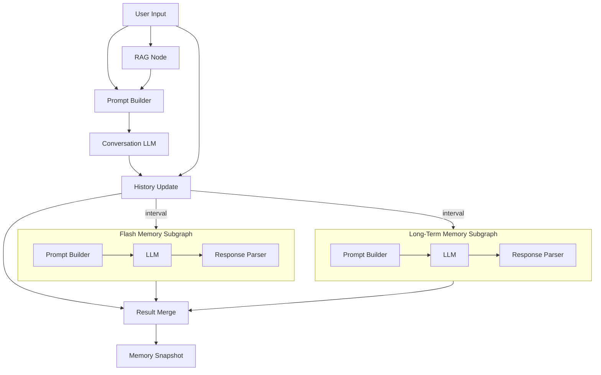

# Inworld Memory CLI

Long-term AI agent memory using [Inworld Runtime](https://inworld.ai).

## Usage

```bash
cp .env.example .env
```

Add your INWORLD_API_KEY to the .env file

```bash
npm install
npm start
```

## Graph Architecture



## Project Structure

```
src/
├── index.ts                    # CLI entrypoint
├── graphs/
│   ├── conversation_graph.ts   # Main graph builder
│   ├── nodes/
│   │   ├── conversation_prompt_node.ts
│   │   ├── history_update_node.ts
│   │   └── rag_node.ts
│   └── templates/
│       └── conversation_prompt.jinja
├── memories/
│   ├── types.ts                # Memory types
│   ├── common/nodes/
│   │   └── result_merge_node.ts
│   ├── flash/
│   │   ├── flash_subgraph.ts
│   │   ├── nodes/
│   │   └── templates/
│   └── long_term/
│       ├── long_term_subgraph.ts
│       ├── nodes/
│       └── templates/
├── storage/
│   └── memory_store.ts         # Persistence layer
└── utils/
    ├── debug_store.ts
    └── logger.ts
```

